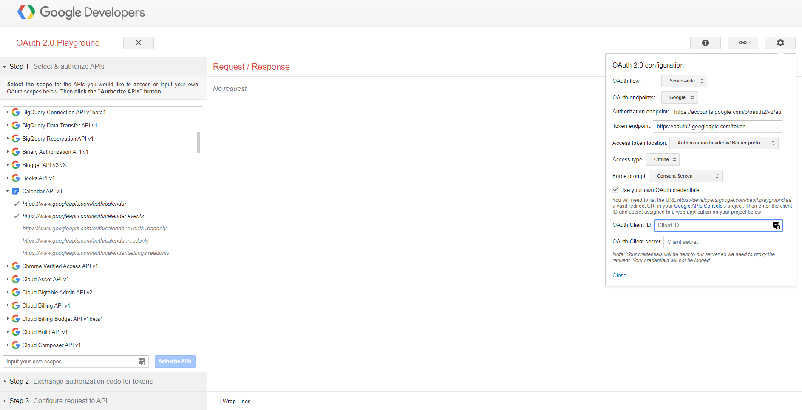
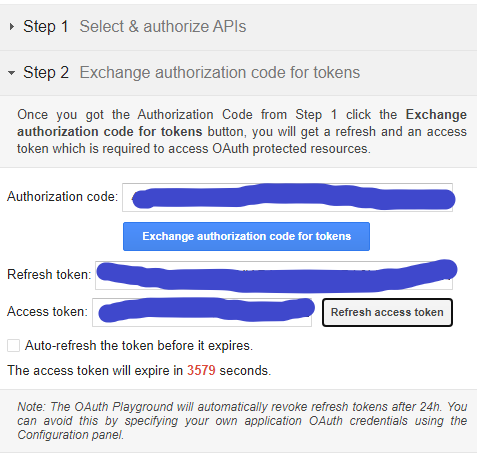

This article will explain how I used [ExpressJS](https://expressjs.com/) to create an API where I can perform create, read and update operations to the. Most of what I've learned was via the [Official Google Calendar API documentation](https://developers.google.com/calendar/v3/reference) and [freecodecamp](https://www.freecodecamp.org/learn/apis-and-microservices/)

Link to the finished example: https://github.com/kaz-yamada/google-calendar-api-example

Disclaimer: I'm very much a novice when working with Google APIs and backend stuff, if you find if there's anything wrong in this article feel free to make a new [issue](https://github.com/kaz-yamada/kazyamada.com/issues) on my Github.

# Prerequisites

- Have [NodeJS and NPM](https://nodejs.org/en/) installed and have a basic understanding of it

# What we will do in this article

- Make an ExpressJS server that call the Google Calendar API and creates a new event as well as return a list of events from a Google account.

# Setting everything up

Create a directory in where we will be working out of.

```shell:title=CLI
mkdir express-app
cd express-app
```

Create a package.json file with and follow the on screen prompts until you reach the end.

```shell:title=CLI
npm init
```

## ExpressJS and Dotenv

Install ExpressJS and dotenv save it in the dependencies list.

```shell:title=CLI
npm install express dotenv
```

Create an entry file `index.js` and return a simple message

```js:title=index.js
const express = require("express");
const app = express();
const port = 3000;

app.get("/", (req, res) => res.send("Hello World!"));

app.listen(port, () =>
  console.log(`Example app listening at http://localhost:${port}`)
);
```

Enter the command below in your terminal to run the express server

```shell:title=CLI
node index.js
```

Now your express app is running on http://localhost:3000, now you can open that address up in your browser and your 'Hello World' message will appear.

## (Optional) Watching for changes with Nodemon

During development if you dont want to shut down and start up the server every time you make a change we can install [Nodemon](https://nodemon.io/) as dev dependency.

```shell:title=CLI
npm install -D nodemon
```

Now use the following command to run your project:

```shell:title=CLI
npx nodemon index.js
```

Now when you make changes to `index.js` it will automatically watch for changes instead of needing to restart your server every time.

# Create a new Google Cloud project and enable the Calendar API

1. Go to the [Google Developer Console](https://console.developers.google.com/) and create a project
2. [Enable the Google Calendar API](https://console.developers.google.com/apis/library/calendar-json.googleapis.com). If you have multiple projects on Google Cloud, make sure the selected project is the one you made.
3. [Create an OAuth consent screen](https://console.developers.google.com/apis/credentials/consent) in order to login to Google via OAuth, essentially its the screen you see whenever 'Log in with Google' on sites that have that option.
4. [Go to the credentials page on your project](https://console.developers.google.com/apis/credentials/). Then click "Create credentials" and select "OAuth Client ID" from the dropdown menu
   1. Select "Web Application" from the dropdown menu
   2. Add https://developers.google.com/oauthplayground to the "Authorized redirect URIs"
   3. Click create, then copy the client id and secret to a .env file. But keep the window open, we'll need it to get a refresh token

## Get a refresh token

Open up [Google's OAuth Playground](https://developers.google.com/oauthplayground)



To get the refresh token:

1. Click on the cog on the top right
2. Click on the **Use your own OAuth credentials** checkmark
3. Enter the OAuth client ID and secret we got previously in their respective fields
4. Select **"Calendar API v3"** in the list of APIs on the left
5. Select "https://www.googleapis.com/auth/calendar" and "https://www.googleapis.com/auth/calendar.events"
6. Click on the **"Authorize APIs"** button
7. Log in with your Google account where you want to access the calendar of

NOTE: You'll get a warning screen stating that "This app isn't verified" since we haven't submitted our app to Google. Since we're still in development we can just click on **Advanced > Go to {Project Name} (unsafe)**.
If you want to use the app in production you need to submit your app to [Google to be verified](https://support.google.com/cloud/answer/7454865) to remove the warnings.

9. Click on **Allow** to the prompts that come up to give your app access to your calendar

You should be returned to the OAuth playground, you should be able to get a refresh token by clicking on **"Exchange authorization code for tokens"**



Now that we have everything to make calls to the Calendar API, we'll save them to our .env file in the root of our project. Since we're accessing some sensitive stuff make sure to keep the secret and refresh token out of your Git commits.

```editorconfig:title=.env
CLIENT_ID='client id here'
CLIENT_SECRET='client secret here'
REFRESH_TOKEN ='refresh token here'
```

# Make calls to Google's API

## Load the client

To make calls to Google's API, we'll need to install the Google API client for Nodejs

```shell:title=CLI
npm install googleapis
```

[Docs for OAuth client](https://github.com/googleapis/google-api-nodejs-client#oauth2-client)

Once that's done we'll write a function that loads the OAuth client and set our credentials that we got earlier. The function below sets the refresh token to used globally, so any calls we make with the client will use the token that we have set.

```js:title=apiClient.js
const { google } = require("googleapis");

const token = process.env.REFRESH_TOKEN;
const client_id = process.env.CLIENT_ID;
const client_secret = process.env.CLIENT_SECRET;
const redirect_url = "localhost:3000";

const loadClient = () => {
  const auth = new google.auth.OAuth2(client_id, client_secret, redirect_url);

  auth.setCredentials({ refresh_token: token });
  google.options({ auth });
};

const makeApiCall = () => {
  const calendar = google.calendar({ version: "v3" });
};
```

You can also set the authentication client at the service-level

```js
const oauth2Client = new google.auth.OAuth2(
  YOUR_CLIENT_ID,
  YOUR_CLIENT_SECRET,
  YOUR_REDIRECT_URL
);
oauth2Client.setCredentials({ refresh_token: YOUR_REFRESH_TOKEN });

const calendar = google.calendar({ version: "v3", auth: oauth2Client });
```

## Create a new event

[Documentation for event: insert](https://developers.google.com/calendar/v3/reference/events/insert)

The calendar id is set to "primary", this is the default calendar for your Google account. To create an event the required fields are the start and end time for the event,

```js:title=apiClient.js
const createEvent = (callback) => {
  // Instance of calendar
  const calendar = google.calendar({ version: "v3" });

  // Start date set to next day 3PM
  const startTime = new Date();
  startTime.setDate(startTime.getDate() + 1);
  startTime.setHours(15, 0, 0, 0);

  // End time set 1 hour after start time
  const endTime = new Date(startTime.getTime());
  endTime.setMinutes(startTime.getMinutes() + 60);

  const newEvent = {
    calendarId: "primary",
    resource: {
      start: {
        dateTime: startTime.toISOString(),
      },
      end: {
        dateTime: endTime.toISOString(),
      },
    },
  };

  calendar.events.insert(newEvent, (err, event) => {
    if (err) console.log(err);
    callback(event.data.htmlLink);
  });
};
```

Head on over to https://calendar.google.com/calendar see your new created event

## Check for events

https://developers.google.com/calendar/v3/reference/freebusy/query

In the case if we want to check if there's already an event in the time slot, we'll make a freebusy query to check for events

```js:title=apiClient.js
const getEvents = (instance, event, callback) => {
  const calendarId = "primary";
  const query = {
    resource: {
      timeMin: event.start.dateTime,
      timeMax: event.end.dateTime,
      items: [{ id: calendarId }],
    },
  };

  // Return a list of events
  instance.freebusy
    .query(query)
    .then((response) => {
      const { data } = response;
      const { calendars } = data;
      const { busy } = calendars[calendarId];

      callback(null, busy);
    })
    .catch((err) => {
      callback(err, null);
    });
};
```

We can modify the `createEvent` function to use the `getEvents` query:

```js:title=apiClient.js
const createEvent = (callback) => {
  // Instance of calendar
  const calendar = google.calendar({ version: "v3" });

  // Start date set to next day 3PM
  const startTime = new Date();
  startTime.setDate(startTime.getDate() + 1);
  startTime.setHours(15, 0, 0, 0);

  // End time set 1 hour after start time
  const endTime = new Date(startTime.getTime());
  endTime.setMinutes(startTime.getMinutes() + 60);

  const newEvent = {
    calendarId: "primary",
    resource: {
      start: {
        dateTime: startTime.toISOString(),
      },
      end: {
        dateTime: endTime.toISOString(),
      },
    },
  };

  getEvents(calendar, newEvent.resource, (err, busyList) => {
    if (busyList.length === 0) {
      calendar.events.insert(newEvent, (err, event) => {
        if (err) console.log(err);
        callback({
          message: "Event successfully created",
          link: event.data.htmlLink,
        });
      });
    } else {
      callback({
        message: `Event already exists at ${startTime.toString()}`,
      });
    }
  });
};
```

## Get events from calendar

Docmentation for getting list of events: https://developers.google.com/calendar/v3/reference/events/list

Getting events is simmilar to creating events. The required fields to get a list of events is the _calendar id_, but we can add filters to get results that are relevent to our app.

```js
const listEvents = (callback) => {
  const calendar = google.calendar({ version: "v3" });
  calendar.events.list(
    {
      calendarId: "primary",
      timeMin: new Date().toISOString(), // Look for events from now onwards
      maxResults: 10, // Limit to 10 events
      singleEvents: true,
      orderBy: "startTime",
    },
    (err, res) => {
      if (err) return console.log("The API returned an error: " + err);

      const events = res.data.items;
      callback(events);
    }
  );
};
```

## Create routes for Express server

Finally we can put everything together with the express server, we'll add 2 routes: one to get

```js:title=apiClient.js
require("dotenv").config();
const express = require("express");
const { loadClient, listEvents, createEvent } = require("./apiClient");

const app = express();
const port = 3000;

loadClient();

// Make a GET request to return a list of events in JSON
app.get("/", function(req, res) {
  listEvents((events) => res.json(events));
});

// Make a POST request to create a new event in the calendar
app.post("/create", (req, res) => {
  createEvent((event) => {
    res.json(event);
  });
});

app.listen(port, () =>
  console.log(`Example app listening at http://localhost:${port}`)
);
```

Now start up your server with

```shell:title=CLI
node index.js
```

Then you can make a GET request to localhost:3000 and a POST request to localhost:3000/create to list and create events respectively.

```shell:title=CLI
curl --request POST localhost:3000/create
curl localhost:3000
```
